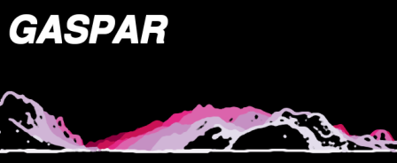

## *Geoviz Application for Searching People And Rescuing* - Prototype developed under [CHOUCAS Projet](http://choucas.ign.fr))

> **Geovisualization interface prototype** that exploits the **Choucas Ontology Alert** (Ontologie d'Alerte Choucas - http://purl.org/oac) and whose functionalities aim to support, facilitate and optimize the rescuer's reasoning.  

> The version whose code is available here is an evolution of the interface prototype described (alongside the ontology) in :  
>  *__L’Ontologie d’Alerte Choucas : de la modélisation des connaissances à un outil support d’un raisonnement géovisuel - Application à la recherche de victime en haute-montagne__. Matthieu Viry & Marlène Villanova-Oliver. SAGEO'19. Clermont-Ferrand, 14 nov. 2019.*.  
> Which was extended in :  
>  *__Ontologie d’Alerte Choucas : de la modélisation des connaissances à un outil support d’un raisonnement géovisuel - Application à la recherche de victime en haute-montagne__. Matthieu Viry & Marlène Villanova-Oliver. Geomatica, Association canadienne des sciences géomatiques, 2020, 73 (3), pp.87-103. doi: 10.1139/geomat-2020-0005.*  


## Usage - Option 1, without Docker

In this setup, Ruitor, Neo4j DB and Gaspar are expected to be installed on the same environment.

#### Installation

**Required dependencies:** `Python 3.7+, git, nodejs & npm`.  

- Copy this repository:

```bash
git clone https://github.com/ANRChoucas/GASPAR/ \
  && cd GASPAR
```

- Set up a Python virtual environment:

```bash
python3 -m virtualenv venv
```

- Activate the virtual environment:

```bash
source venv/bin/activate
```

- Install Python dependencies:

```bash
pip install -r requirements.txt
python -m spacy download fr_core_news_sm
```

- Install Node dependencies:

```bash
npm install
```

#### Starting up auxiliary services

**Two external services are needed:**
1. **Neo4j** using CHOUCAS.1 database, listening on port 7687 (available on Choucas FTP)
2. **Ruitor** listening on port 8000 (available on https://github.com/ANRChoucas/Ruitor/)


- Start Neo4j server if not done yet:

```bash
neo4j start
```

- Start Ruitor:

> See https://github.com/ANRChoucas/Ruitor/ for more information.


#### Launching GASPAR

- Activate the virtual environment (if not done yet):

```bash
source venv/bin/activate
```

- Export Neo4j credentials (used by Python code to connect to Neo4j):

```bash
export NEO4J_USER="neo4j"
export NEO4J_PASSWORD="secret"
```


- Start the server application and watch for changes in JS code:

```bash
python server_app.py & npm run watch
```

*This command starts the Python server application while watching for changes in Javascript code: the application is now accessible in a web-browser on http://localhost:8008/.*


## Usage - Option 2, with Docker

In this setup, Gaspar will be running in a Docker container and Neo4j DB and Ruitor will be running on the host, listening respectively on port 7687 and 8000.

**Required dependencies:** `Git, Docker 18.03+ (Windows / MacOS) or 20.10+ (GNU/Linux)` *(these minimum versions are required because of the use of "host.docker.internal" networking feature)*.  

#### Building the container

*It may take some time because it has to fetch and install some dependencies but it's a one-time operation.*

- Copy this repository:

```bash
git clone https://github.com/ANRChoucas/GASPAR/ \
  && cd GASPAR
```

- Actually build the container:

```bash
docker build -t "gaspar_choucas" .
```

#### Starting up auxiliary services


Be sure that Neo4j accepts non-local connections, by uncommenting the following line in `neo4j.conf`:

```
dbms.connectors.default_listen_address=0.0.0.0
```

Otherwise, it is up to you to launch **Neo4j** and **Ruitor**.


#### Launching GASPAR


```bash
docker run \
  --publish "8008:8008" \
  --add-host host.docker.internal:host-gateway \ # only on GNU/Linux
  --env NODE_ENV=developement \
  --env HOST_IP=host.docker.internal \
  --env NEO4J_USER=neo4j \ # replace by your neo4j username
  --env NEO4J_PASSWORD=secret-neo4j-password \ # replace by your neo4j password
  -it "gaspar_choucas:latest"
```

*This command starts the Python server application inside Docker container: the application is now accessible in a web-browser on http://localhost:8008/.*


## Video demonstrations

- [Guided tour of the interface *(no sound)*](https://steamer.imag.fr/wp-content/uploads/2019/10/screencast_gaspar_tour_guide.mp4) *(october 2019)*
- [Commented use-case *(comments in french)*](https://steamer.imag.fr/wp-content/uploads/2019/10/screencast_gaspar_usecase_audio.mp4) *(october 2019)*
- [Use-case after integrating Neo4j DB and Ruitor *(no sound)*](https://cloud.univ-grenoble-alpes.fr/index.php/s/PoR3cYtbbTnoEMy) *(mars 2021)*
- [Use-case with the new choices of graphical portrayal for the location zones (no sound)](https://cloud.univ-grenoble-alpes.fr/index.php/s/a9t6iSXDM5RW5wY) *(mars 2022)*


## Previous versions

Other developments have been done on the visualisation prototype beforehand:

- the version from Matthew Sreeves internship is on branch [`matthews-jul2018`](https://github.com/ANRChoucas/GASPAR/tree/matthews-jul2018)
- the version from Jacques Gautier work is on branch [`jacquesg-jul2019`](https://github.com/ANRChoucas/GASPAR/tree/jacquesg-jul2019)


## Other details

#### Technical overview

Server code uses `aiohttp`.

Client code notably uses `webpack` (to bundle the code), `lumino` (providing a flexible tab-based layout), `openlayers`, `itowns` and `sweetalert`.

#### Browser compatibility

Intended browser compatibility : last 2 (desktop) versions of Chrome and Firefox + last version of Opera and Safari.

#### Code style

Python source code follows PEP8 conventions (use `flake8` to ensure it) and Javascript code style follows AirBNB guidelines (with some minor amendments) and is enforced with `ESLint` (see `.eslintrc.js` file for details).


#### Repository structure

```
GASPAR                   <--- GASPAR interface "root" folder
│
├── data
│   └── osm               <--- Some data extracted from OSM (GeoJSON format)
│
├── dist                  <--- Static assets after compilation
│
├── src                   <--- Source files for client code
│   ├── css
│   ├── img
│   ├── js
│   └── json              <--- JSONschemas derived from Choucas Ontology Alert
│
└── server_app.py         <--- Source file for server code
```

## License

The code is provided under BSD 3-clause licence.

Geospatial features in use (in `data/osm`) are coming from OpenStreetMap (credits: OpenStreetMap Contributors), the licence is the [ODbL](https://opendatacommons.org/licenses/odbl/index.html).


